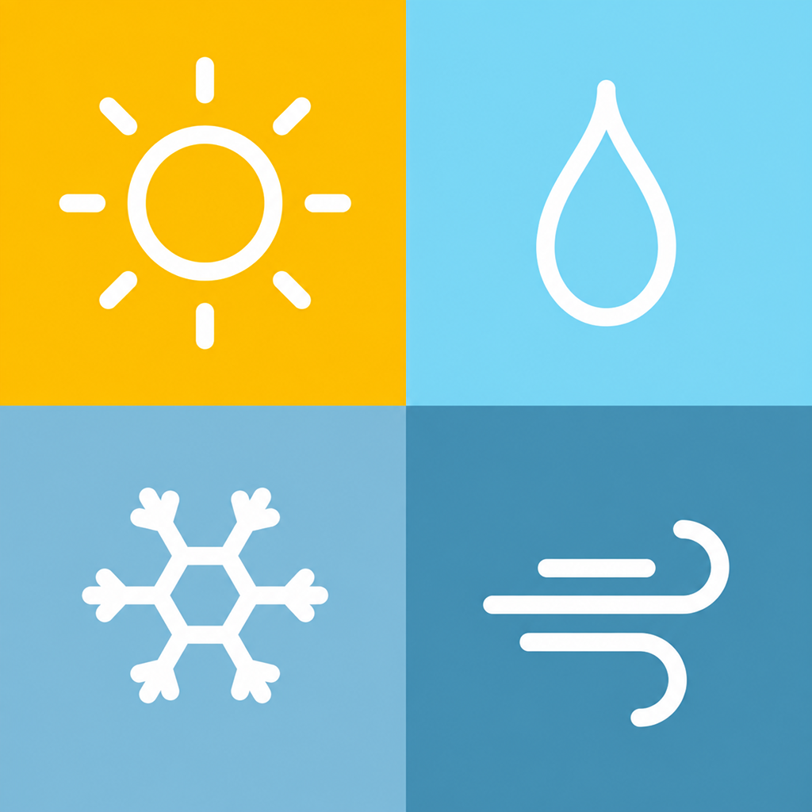
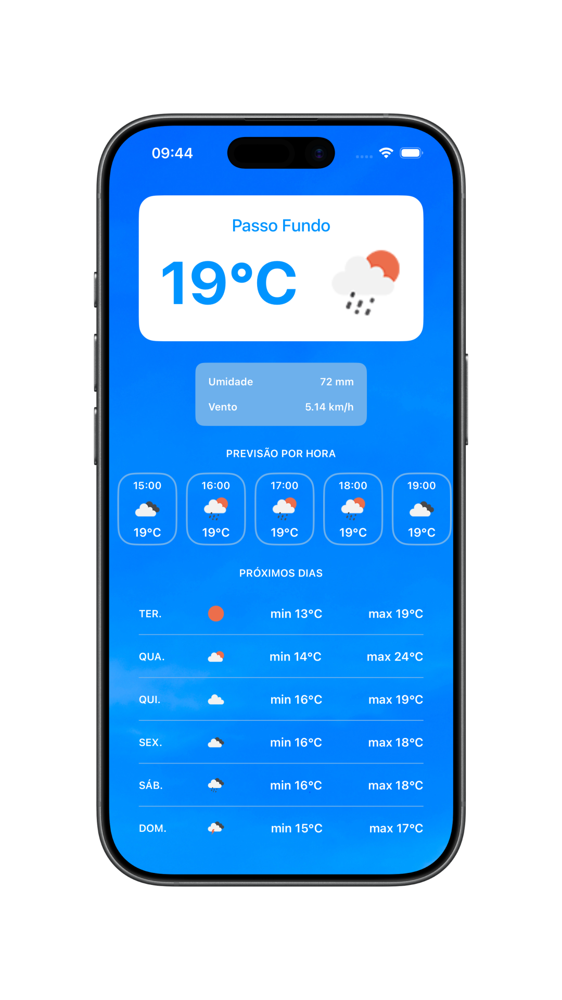

<div align="center">
  

  # WeatherForecast

  Um aplicativo iOS para visualizar as condições do tempo e acompanhar previsões por hora e por dia.

  [](https://www.swift.org/)
  [](https://developer.apple.com/documentation/uikit)
  [](#arquitetura)
</div>

## 📱 Sobre o projeto

O **WeatherForecast** é um aplicativo iOS de previsão do tempo. A interface apresenta a cidade de Passo Fundo, a temperatura em Celsius, um ícone das condições do tempo e informações de umidade e velocidade do vento.

Na mesma tela, o usuário pode percorrer a previsão por hora em uma lista horizontal e consultar as temperaturas mínimas e máximas dos próximos dias. A imagem de fundo alterna entre dia e noite de acordo com o horário informado nos dados da previsão atual.

Desenvolvido em **Swift**, o projeto utiliza **UIKit com View Code**, **Auto Layout** e arquitetura **MVVM**. Os dados são carregados com **URLSession** a partir de um JSON de demonstração hospedado no **GitHub Gist** e decodificados com **JSONDecoder**.

> A cidade exibida está definida no código e os dados são de demonstração, sem atualização meteorológica em tempo real.

## 🖼️ Demonstração

<p align="center">
  
</p>

## ✨ Funcionalidades

- Exibição da temperatura em Celsius e ícone das condições do tempo
- Informações de umidade e velocidade do vento
- Previsão por hora com rolagem horizontal
- Previsão dos próximos dias com temperaturas mínimas e máximas
- Fundo diurno ou noturno conforme o horário dos dados da previsão atual
- Carregamento de dados de demonstração por requisição HTTP
- Exibição de alerta em caso de falha no carregamento

## 🛠️ Tecnologias

| Tecnologia | Uso no projeto |
| --- | --- |
| Swift 5 | Linguagem principal |
| UIKit + View Code | Construção da tela e dos componentes por código |
| Auto Layout | Posicionamento e dimensionamento dos elementos da interface |
| MVVM | Separação entre interface, apresentação e acesso aos dados |
| UICollectionView | Lista horizontal da previsão por hora |
| UITableView | Lista da previsão dos próximos dias |
| URLSession | Requisição HTTP para carregar o JSON remoto |
| Decodable + JSONDecoder | Decodificação do JSON em modelos Swift |
| GitHub Gist | Hospedagem do JSON de demonstração |

<a id="arquitetura"></a>

## 🏗️ Arquitetura

A tela principal é organizada em `HomeViewController`, `HomeScreen` e `HomeViewModel`. As previsões por hora e por dia utilizam células próprias, enquanto modelos, serviço de rede, recursos visuais e utilitários ficam em pastas compartilhadas.

```text
WeatherForecast/
├── App/             # Ciclo de vida e ponto de entrada
├── Features/
│   ├── Home/        # Tela principal, ViewController e ViewModel
│   └── Cells/       # Células das previsões por hora e por dia
├── Model/           # Modelos da resposta e das previsões
├── Service/         # Requisição HTTP e decodificação do JSON
├── Resources/       # Ícones, imagens de fundo e demais assets
└── Utils/           # Extensões, cores e tipografia
```

O fluxo da tela segue, de forma simplificada:

```text
HomeScreen → HomeViewController ⇄ HomeViewModel → Service → JSON remoto
```

## 🚀 Como executar

1. Clone o repositório:

   ```bash
   git clone https://github.com/julianosgarbossa/WeatherForecast.git
   cd WeatherForecast
   ```

2. Abra o projeto no Xcode:

   ```bash
   open WeatherForecast.xcodeproj
   ```

3. Selecione um simulador de iPhone com **iOS 26.5 ou superior**, conforme o Deployment Target configurado no projeto, e execute com `⌘R`.

> O projeto utiliza apenas frameworks nativos e não exige instalação de dependências externas nem configuração de chave de API. É necessário acesso à internet para carregar o JSON de demonstração.
